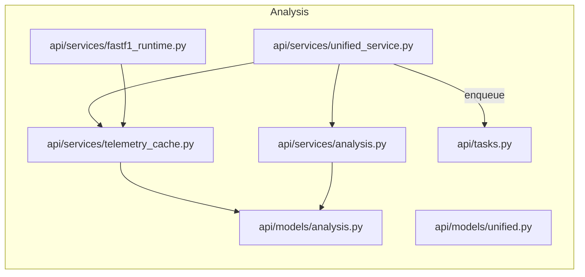

# Analysis & Unified — Code Map

This document covers the unified service and analysis/telemetry subsystems: models, telemetry caching, FastF1 runtime adapters, and analysis helpers.

Files:

- `api/models/unified.py`: session data / unified DTO models persisted for later analysis.
- `api/models/analysis.py`: telemetry-related models and analysis persistence.
- `api/services/unified_service.py`: high-level unified read service orchestrating results, drivers, telemetry.
- `api/services/analysis.py`: analysis helpers (consistency metrics, telemetry aggregation).
- `api/services/telemetry_cache.py`: telemetry-focused caching layer for session and lap data.
- `api/services/fastf1_runtime.py`: FastF1 runtime adapter for live session extraction.
- `api/services/extraction.py`: raw telemetry extraction helpers.
- `api/session/runtime.py`: runtime session orchestration/helpers.
- `api/session/fake_fastf1.py`: test harness for FastF1 behavior.

Diagram:

Notes:

- Unified service is the entrypoint for combined views (e.g., session + driver + result cross-joins).
- Telemetry caching uses a separate cache alias and a TTL ladder to avoid stale reads.
