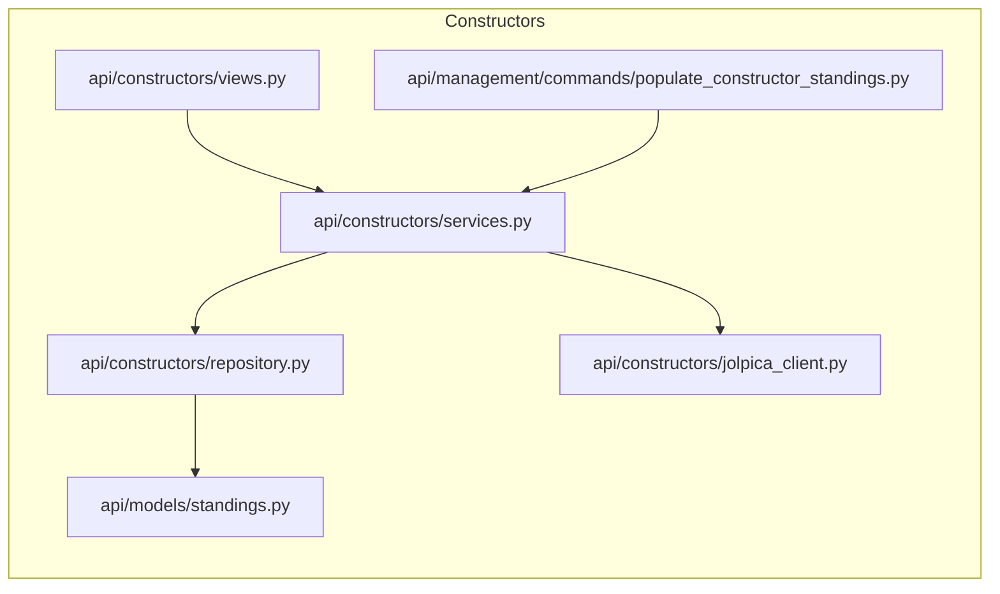

# Constructors — Code Map

Files under `backend/api/constructors` and related items used to build constructor standings and constructor-specific endpoints.

Files:

- `api/constructors/__init__.py`
- `api/constructors/views.py`
- `api/constructors/urls.py`
- `api/constructors/serializers.py`
- `api/constructors/repository.py`
- `api/constructors/services.py`
- `api/constructors/jolpica_client.py`

Diagram:

Notes:

- Constructor standings are populated by management commands and background tasks; repository functions centralize DB access.
