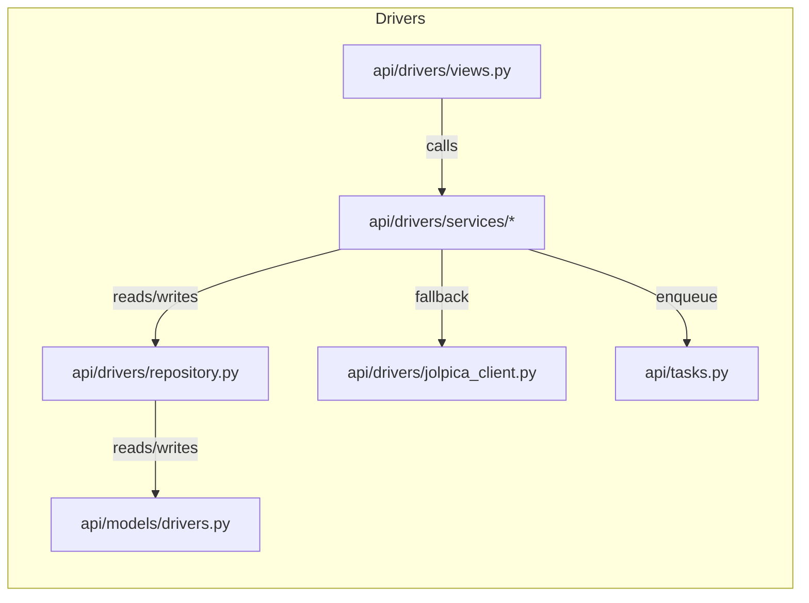

# Drivers — Code Map

This file lists driver-related code files in `backend/api/drivers` and related services, with descriptions and a mermaid diagram showing relationships.

Files:

- `api/drivers/__init__.py`: package init.
- `api/drivers/views.py`: HTTP views for driver endpoints (search, season, standings, career). Uses DB-first pattern and non-blocking behaviors.
- `api/drivers/urls.py`: URL routing for driver endpoints.
- `api/drivers/serializers.py`: DRF serializers for driver DTOs (season, career, standings).
- `api/drivers/repository.py`: ORM read helpers for persisted driver data (standings, career, season breakdowns).
- `api/drivers/jolpica_client.py`: External Jolpica/Ergast HTTP client for driver-related API calls.
- `api/drivers/fake_jolpica.py`: Test stub for Jolpica API responses.

Services (drivers):

- `api/drivers/services/sync_service.py`: `DriverSyncService` — DB-first driver sync service with Jolpica fallback and upsert logic.
- `api/drivers/services/standings.py`: Driver standings builder and readiness helper.
- `api/drivers/services/season.py`: Driver season breakdown service.
- `api/drivers/services/career.py`: Driver career aggregation service.

Diagram:

If you'd like I can add file-level code snippets or trace a single endpoint call end-to-end.
