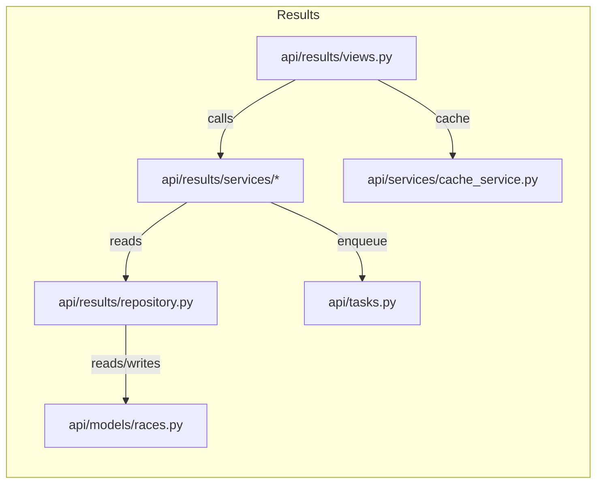

# Results & Races — Code Map

This document catalogs files under `backend/api/results` and related helpers used to build race, qualifying, sprint, and practice results.

Files:

- `api/results/__init__.py`
- `api/results/views.py`: HTTP views for race/qualifying/practice endpoints. Uses non-blocking pattern and read-through cache.
- `api/results/urls.py`
- `api/results/serializers.py`
- `api/results/repository.py`: Persistence-layer helpers for persisted results.
- `api/results/helpers.py`
- `api/results/services/practice.py`
- `api/results/services/qualifying.py`
- `api/results/services/race.py`
- `api/results/services/sprint.py`
- `api/results/services/weekend.py`

Diagram:

Notes:

- Results endpoints heavily use the non-blocking Module S pattern via `api/services/nonblocking.py`.
- `populate_race` and related mgmt commands/Celery tasks persist final results to DB.
