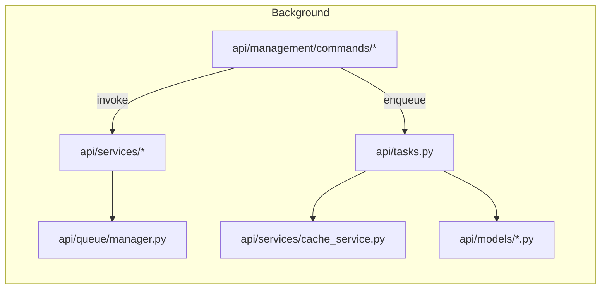

# Services, Queue & Background Tasks — Code Map

Files for services, task management, queueing, and management commands.

Files:

- `api/services/__init__.py`
- `api/services/utils.py`
- `api/services/task_manager.py`: TaskRecord/TaskManager integration for background dedup and tracking.
- `api/services/tasks.py`: service-level helpers invoked by Celery tasks and mgmt commands.
- `api/services/store.py`: persistence helpers and upsert utilities.
- `api/services/session_registry.py`: session LRU / registry functions.
- `api/services/seeding.py`: initial historical seeding helpers.
- `api/services/schedule.py`: schedule service for calendar data.
- `api/services/results.py`: shared results helpers.
- `api/services/readiness.py`: readiness probes used by endpoints/tests.
- `api/services/persistence.py`: DB persistence utilities.
- `api/services/pagination_cache.py`: pagination-aware caching helpers.
- `api/services/nonblocking.py`: Module S non-blocking pattern helpers.
- `api/services/cache_service.py`: wrapper around Django caches/Redis (load-locks, safe fallbacks).
- `api/services/cache.py`: higher-level cache helpers.
- `api/queue/manager.py`: task queue manager abstraction.
- `api/tasks.py`: Celery task definitions (populate_telemetry, sync_drivers, etc.).
- `api/management/commands/*`: management commands (sync*drivers, populate*\*, create_internal_key, etc.).

Diagram:

Notes:

- Task deduplication and task status tracking is centralized in `task_manager.py` and `cache_service.py`.
- Management commands provide bulk population flows used for historical seeding and migration.
