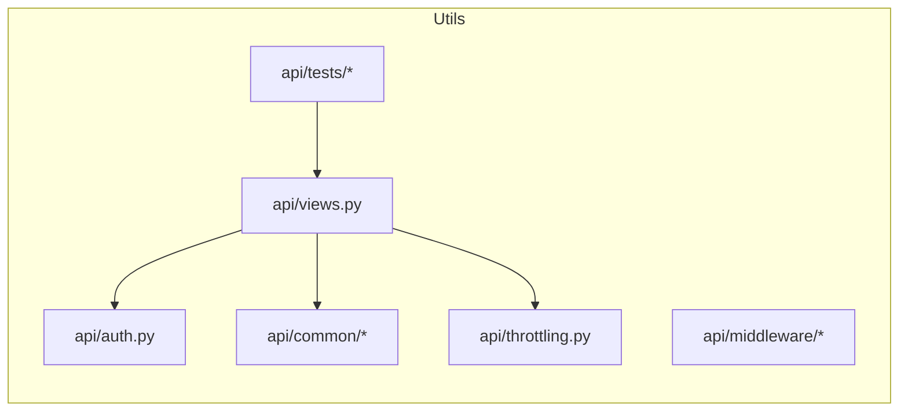

# Utilities, Middleware, Auth & Tests — Code Map

Files for shared utilities, middleware, auth, throttling, common helpers, and tests.

Common utilities and middleware:

- `api/common/__init__.py`
- `api/common/utils.py`
- `api/common/serializers.py`
- `api/common/response.py`
- `api/common/request_id.py`
- `api/common/readiness.py`
- `api/common/pagination.py`
- `api/common/mixins.py`
- `api/common/constants.py`
- `api/middleware/no_cache.py`
- `api/middleware/csrf_exempt.py`
- `api/auth.py`: API key authentication and DB/cache fallback; now logs cache outages and fails-open for cache reads.
- `api/throttling.py`: token-bucket rate limiter adapted to fail-open on Redis outages.
- `api/exception_handlers.py`
- `api/urls.py`
- `api/views.py` and `api/views/*`: top-level views (task_status, registration, cache decorators, task_management).

Tests:

- `api/tests/unit/*`: unit tests for utils, unified service, driver endpoints, persistence fallback, readiness checks.
- `api/tests/integration/*`: integration tests (live services).

Diagram:

Notes:

- `auth.py` and `throttling.py` were updated to log Redis outages and fall back to DB or allow requests respectively.
- Tests exercise readiness and caching fallbacks; run with `--keepdb --noinput` for non-interactive runs.
