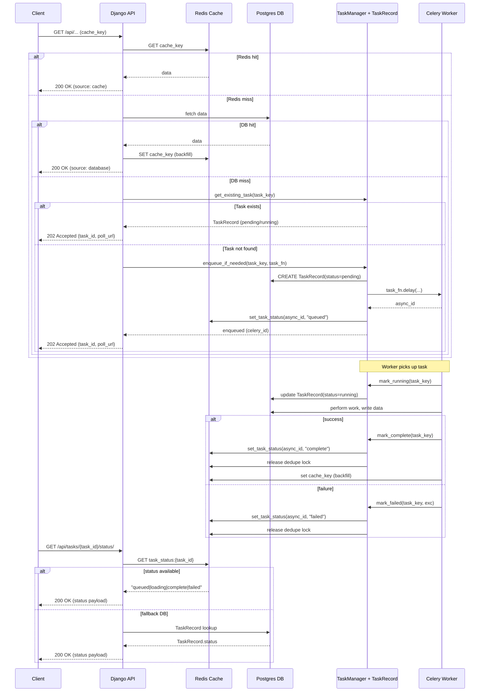

**System Architecture and Non-blocking Data Flow**

Overview

- **Server**: Django REST API (backend/api) — non-blocking endpoints use `await_or_enqueue_data()` to return quickly.
- **Cache**: Redis (via Django cache) — first read priority; holds session data, load locks, and task status keys.
- **DB**: PostgreSQL — persistent store; authoritative source for data and `TaskRecord` model.
- **Queue / Workers**: Celery workers (multiple tiers) process background tasks and update DB + cache.

Key components (see code)

- **Task lifecycle manager**: [backend/api/queue/manager.py](backend/api/queue/manager.py#L1-L120)
- **Non-blocking view helper**: [backend/api/services/nonblocking.py](backend/api/services/nonblocking.py#L1-L120)
- **Cache service**: [backend/api/services/cache_service.py](backend/api/services/cache_service.py#L1-L120)
- **Celery tasks**: [backend/api/workers/](backend/api/workers/)

High-level behavior

- Client requests session/aggregate data from API endpoint.
- API calls `await_or_enqueue_data()` (non-blocking pattern):
  1. Check Redis cache  if present, return HTTP 200 with data (fast).
  2. If cache miss, check DB (ORM)  if present, backfill Redis and return HTTP 200.
  3. If both miss, check an in-flight load lock in Redis (SETNX) or existing TaskRecord:
     - If a task is already queued/running: return HTTP 202 Accepted with `task_id` and `poll_url`.
     - If no task exists: create TaskRecord(status="pending"), enqueue Celery task, set Redis load lock and task status, return HTTP 202 Accepted.

Status codes and when they are returned

- 200 OK: Data served synchronously from Redis (cache) or DB (backfilled). See `await_or_enqueue_data()` returns at Step 1/2.
- 202 Accepted: Background work enqueued or already in-flight  response includes `task_id`, `task_key`, `estimated_wait_seconds`, `queue_depth`, and `poll_url`.
- 500 Internal Server Error: Enqueue failed or unexpected exception.

Data & task lifecycle (detailed)

1. Client  Django API endpoint
   - Endpoint calls `await_or_enqueue_data(cache_key, db_fetch_fn, task_fn, task_key, ...)`.

2. Redis cache check
   - Implementation: `cache.get(cache_key)` in `nonblocking.py` / `cache_service.py`.
   - Hit  return 200 with payload built by `build_nonblocking_response_200()`.

3. DB fallback
   - If Redis returns miss and `db_fetch_fn()` returns a result, `nonblocking._backfill_cache()` stores the serialized payload in Redis and API returns 200.

4. Cache miss  Task coordination
   - Check for existing `TaskRecord` via `TaskManager.get_existing_task()` or a load lock via `cache_service.check_load_lock()`.
   - If existing task/lock  API returns 202 with existing Celery task id and poll details.
   - Otherwise, API calls `TaskManager.enqueue_if_needed(task_key, task_fn, ...)`.

5. Enqueue & TaskRecord
   - `TaskManager._dispatch()` creates `TaskRecord(task_key, status="pending")`, acquires a Redis dedupe lock (`SETNX`), then calls `task_fn.delay(...)` to enqueue.
   - Celery async id saved into `TaskRecord.celery_task_id` and a task-status key is set in Redis via `cache_service.set_task_status()`.
   - API returns HTTP 202 with the new `task_id`.

6. Worker execution
   - Worker (a `@shared_task`) calls `TaskManager.mark_running(task_key)` before work  updates `TaskRecord.status = "running"` and `cache_service.set_task_status(..., "loading")`.
   - Worker executes business logic, writes data to DB, then calls `TaskManager.mark_complete(task_key)` on success.
   - On exception, worker calls `TaskManager.mark_failed(task_key, exc)`.

7. Completion backfill & release
   - On success, `mark_complete()` sets `TaskRecord.status = "complete"`, `completed_at`, releases Redis dedupe lock, and sets Redis task status to `complete`.
   - The worker/application also calls `cache_service.set_cache()` to backfill the Redis key for fast subsequent reads.

8. Client polling
   - Clients can poll `GET /api/tasks/{task_id}/status/` (or implement polling via `cache_service.get_task_status(task_id)`) to read `queued|loading|complete|failed`.

Mermaid sequence diagram (client  server  cache/db  task worker)

Notes and operational considerations

- Deduplication: uses Redis SETNX (or cache.add) and `TaskRecord` to ensure at-most-one concurrent load per `task_key`.
- Polling: `task_status:{celery_id}` key provides fast status checks without DB hits.
- TTLs: Cache TTLs and load-lock TTLs are tiered; see `TASK_TIER_MAP` in `queue/manager.py` and `get_load_lock_ttl()` in `cache_service.py`.
- Idempotency: `enqueue_if_needed()` inspects `TaskRecord.status` and stale records (older than STALE_MINUTES) before re-enqueueing.

References

- Non-blocking pattern: [backend/api/services/nonblocking.py](backend/api/services/nonblocking.py#L1-L120)
- Task manager: [backend/api/queue/manager.py](backend/api/queue/manager.py#L1-L160)
- Cache service (load locks & polling): [backend/api/services/cache_service.py](backend/api/services/cache_service.py#L1-L120)

If you want, I can also add a separate Mermaid state diagram for `TaskRecord` transitions (`pending -> running -> complete|failed|cancelled`) and a small example of the JSON bodies returned for 200/202 responses.
