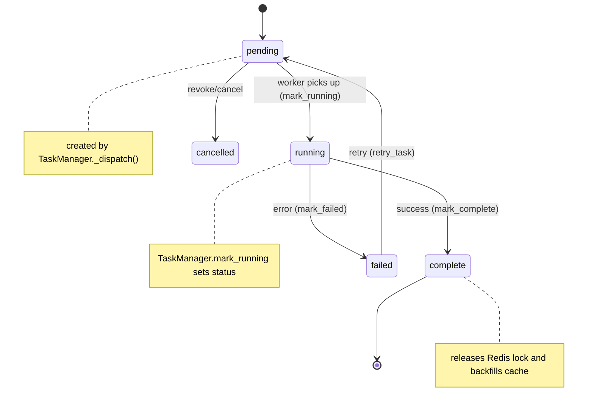

TASK LIFECYCLE

Overview

- The system uses a `TaskRecord` model (DB) and Redis dedupe locks to coordinate background processing.
- `TaskManager` (stateless service) orchestrates enqueueing (`enqueue_if_needed`), dispatch (`_dispatch`), state transitions (`mark_running`, `mark_complete`, `mark_failed`), and cleanup.

TaskRecord core fields (observed usage)

- `task_key` (string): unique logical id for the work (e.g., `seed_round:2026:4`).
- `celery_task_id` (UUID string): Celery async id once enqueued.
- `status` (enum): `pending`, `running`, `complete`, `failed`, `cancelled`.
- `created_at`, `started_at`, `completed_at` (timestamps)
- `error_message` (text): captured traceback on failure

State transitions

Deduplication and locks

- Redis SETNX (cache.set(..., nx=True) or cache.add) protects at-most-one enqueue per `task_key` within a TTL defined per tier.
- `TaskManager._acquire_redis_lock()` uses `TASK_TIER_MAP` to map tasks to queue tiers and TTLs.
- Locks are released in `mark_complete()` and `mark_failed()` immediately (don't wait TTL).

Polling and status keys

- `cache_service.set_task_status(task_id, status)` writes `task_status:{task_id}` keys for quick polling (values: `queued`, `loading`, `complete`, `failed`).
- Clients are expected to poll `/api/tasks/{task_id}/status/` or query the `task_status` key.

Stale tasks and re-enqueue

- `enqueue_if_needed()` skips dispatch if `TaskRecord` is `pending`/`running` and not stale.
- `STALE_MINUTES` defines the staleness cutoff (~10 minutes): older records are treated as crashed and deleted before re-enqueueing.

Cleanup

- `TaskManager.cleanup_completed(older_than_days)` deletes old completed/failed/cancelled `TaskRecord`s and their Redis status/locks.

References

- `backend/api/queue/manager.py`
- `backend/api/services/cache_service.py`
